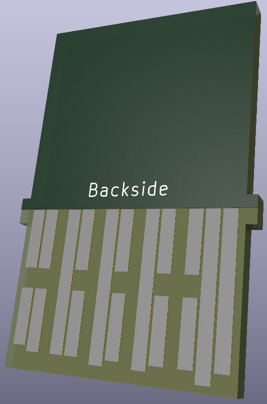

# nx-gamecard
Kicad symbol and footprint of the Nintendo Switch gamecard.

This was reverse engineered using the [SwitchBrew wiki](https://switchbrew.org/wiki/Gamecard) and a calliper.

***This has not yet been tested!***
